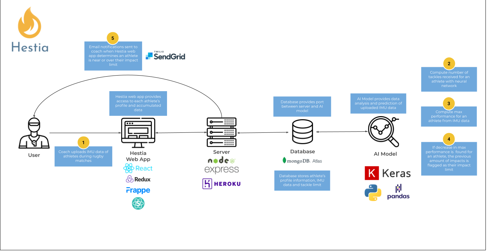

:information_source: This is a public copy of the private repository for my CSC491 capstone project, which is an MVP for a tech startup I had designed and developed with a team throughout the course. Fabian Ulmer and myself (Nikolas Till) developed the code for the MVP of this capstone project and Jin Chun, Zheng Wei Lim, and Sangwoo Kim assisted in the buisness and marketing research for our startup.

# Hestia


Hestia is a company founded in the fitness tech industry. Our startup is named after Hestia, the Greek goddess whose altar of the sanctuary is the origin of the Olympic flame. The symbolism behind Hestia and the Olympic flame parallels with our aim to create a product that cements itself as an inspiring symbol of fitness tech that will live on through the course of time.

## Table of Contents

- [Product & Research](./product_research/)
  - [Video Demo](./product_research/write_up.md)  
  - [Market](./product_research/market.md)
  - [Roadmap](./product_research/roadmap.md)

## Summary of Product

Our product is a web application that allows users to track athletes' performance and [impact limit](./product_research/impact_limit.md) after uploading IMU data they have worn during matches. If an athlete is determined to be near or over their impact limit and be at risk of reducing their performance, users have the option to receive email notifications to better monitor their athletes' progress.

## Architecture Diagram

This diagram represents the architecture of our application and the standard workflow of a coach using it:


### Environments

- Dev Environment: https://hestia-dev.herokuapp.com/ - This environment is connected to our 'dev' branch, pushing to this branch will auto-deploy to Heroku via GitHub actions.
- Staging Environment: https://hestia-staging.herokuapp.com/ - This environment is connected to our 'master' branch, pushing to this branch will auto-deploy to Heroku via GitHub actions.
- Production Environment: https://hestia-webapp.herokuapp.com/ - Staging environment promotes to this environment via Heroku pipeline.

### Bootstrap Application

For Bootstrapping Hestia's application:

1. clone repository

2. run bootstrap script

   ```
   chmod +x script/bootstrap
   script/bootstrap
   ```

### Credits

- Logo created with https://www.ucraft.com/free-logo-maker
